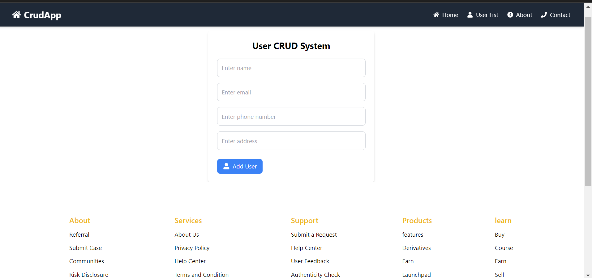
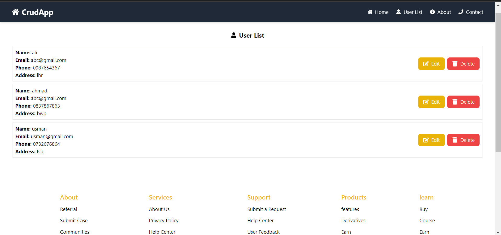
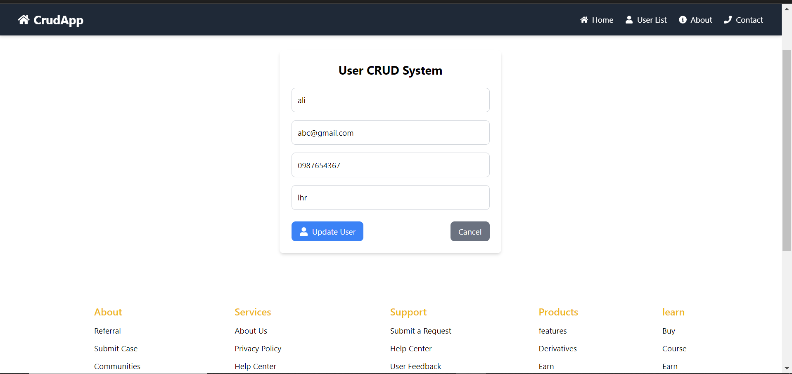

## Crud App

Project is built with React and Redux Toolkit, designed to handle CRUD operations for users. It includes functionalities for adding, updating, and listing users, as well as a user-friendly interface with a responsive layout.

## Features

- **User Form**: Allows users to add or update user information.
- **User List**: Displays a list of all users with options to view details and delete users.
- **Footer**: Contains navigation links and social media icons, styled to be responsive and centered.
- **Navigation**: Integrated routing with `react-router-dom` for navigating between pages.
- **Validation**: Ensures that all required fields are filled and formatted correctly.
- **Submission**: Dispatches actions to add or update user data and handles navigation upon success.

## Quick start

- Recommended `Node.js v18.x`.
- **Install:** `yarn install`
- **Start:** `yarn dev`
- **Build:** `yarn build`for more information.

## Contact 

Email: qurbanhanif120@gmail.com

